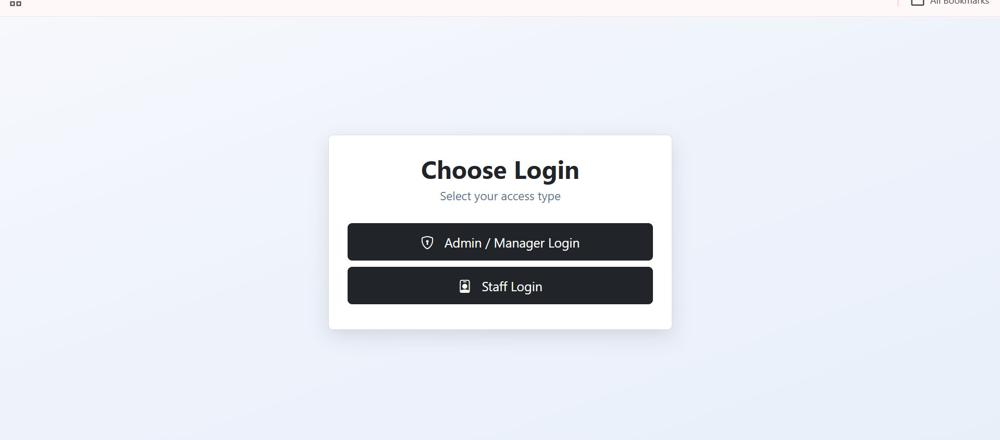
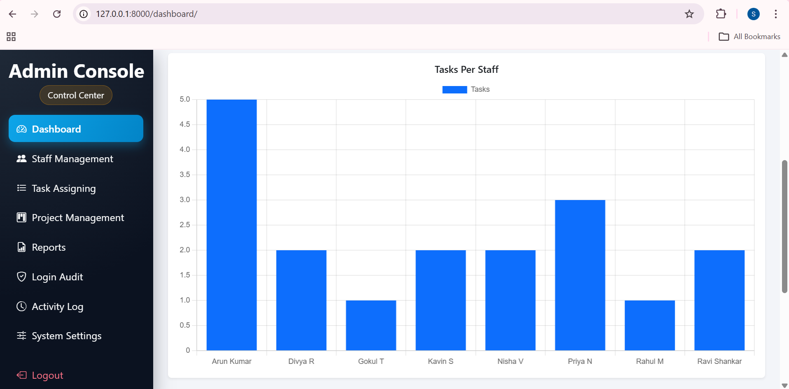
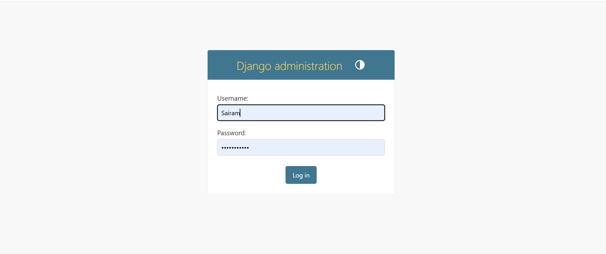
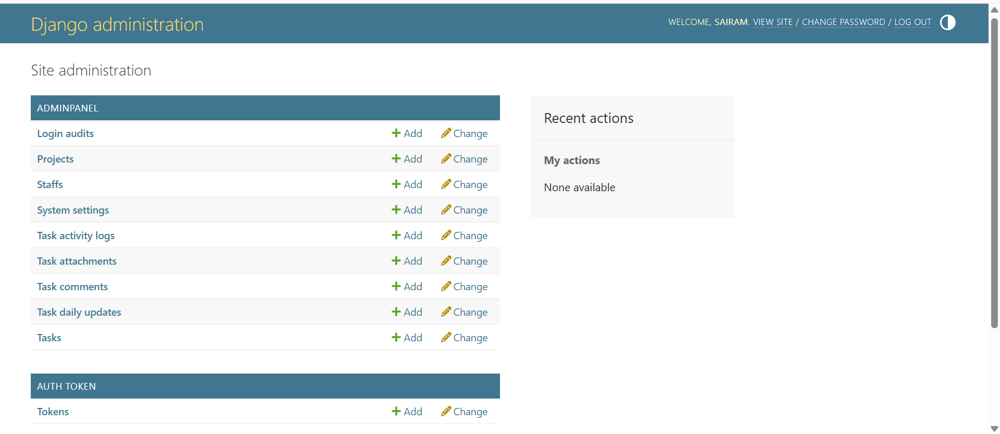
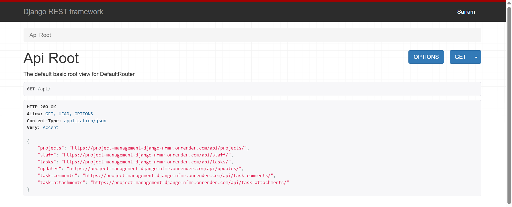

# Project Management System (Django)

Production-ready Django application with admin/staff workflows and REST API support.  
Deployed with PostgreSQL and environment-based configuration.

---

## 🚀 Live Demo

🔗 https://project-management-django-nfmr.onrender.com  

Production deployment on Render with PostgreSQL backend.

---

## 📌 Features

- Admin & Staff role workflows
- Project and Task management
- Django Admin customization
- REST API (Django REST Framework)
- PostgreSQL (Production database)
- Environment-based settings
- Secure production configuration

---

## ⚙️ Tech Stack

- Python
- Django
- Django REST Framework
- PostgreSQL
- Gunicorn
- Render (Deployment)

---

## 📸 Screenshots

## 🔐 Login Selection


## 📊 Admin Dashboard


## 🛠 Django Admin Login


## ⚙ Django Admin Panel


## 🔗 REST API Root


---

## 🛠 Local Setup

Clone the repository:

```bash
git clone <repo-url>
cd project-management-django/project_management
```

Create virtual environment:

```bash
python -m venv venv
venv\Scripts\activate
pip install -r requirements.txt
```

Configure environment:

```bash
Copy-Item .env.dev.example .env.dev
```

Run migrations and start server:

```bash
python manage.py migrate
python manage.py runserver
```

Access locally at:

```
http://127.0.0.1:8000/
```

Note: Local development supports HTTP only.

---

## 🔐 Required Environment Variables (Production)

Use `project_management/.env.production.example` as template.

Minimum required:

```
DJANGO_DEBUG=0
DJANGO_SECRET_KEY=<strong-random-secret>
DJANGO_ALLOWED_HOSTS=<comma-separated-hosts>
DJANGO_DB_ENGINE=postgres

POSTGRES_DB
POSTGRES_USER
POSTGRES_PASSWORD
POSTGRES_HOST
POSTGRES_PORT
```

---

## 🚀 Production Deployment

From `project_management/` directory:

```bash
python manage.py migrate
python manage.py collectstatic --noinput
```

For WSGI servers (Linux):

```bash
gunicorn config.wsgi:application --bind 0.0.0.0:$PORT
```

---

## ⚠️ Security Notes

- Do NOT commit real `.env` files
- Always rotate exposed secrets
- DEBUG must be disabled in production
- Use HTTPS in deployed environments only


